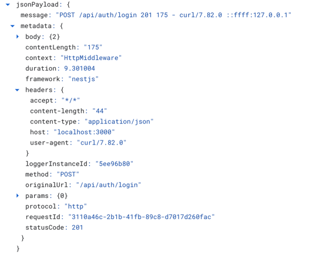

# nestjs-cloud-logging

Extended default NestJS logger with Winston transporter for Google Cloud
Logging.

### 1. Replace default logger when bootstraping

```typescript
// main.ts
import {WinstonLoggerServiceApp} from 'nestjs-cloud-logging';

async function bootstrap() {
    const app = await NestFactory.create(AppModule);
    app.useLogger(app.get(WinstonLoggerServiceApp));

    await app.listen(3000);
}

bootstrap();
```

### 2. Import logger module into root module and registering it globally

```typescript
// app.module.ts
import {WinstonLoggerModule} from 'nestjs-cloud-logging';

@Module({
    imports: [
        WinstonLoggerModule.forRoot({
            isGlobal: true,
            projectId: "google-cloud-project-id",
            keyFilename: "path-to-key-filename",
        }),
    ],
    controllers: [],
    providers: [],
})
export class AppModule {
}
```

### 3. How to inject logger anywhere

```typescript
import {Logger, LoggerService} from 'nestjs-cloud-logging';

@Injectable()
export class UserService {
    constructor(@Logger() private readonly logger: LoggerService) {
    }

    getUser(id: number): Promise<User> {
        this.logger.log('Your logger message');
        return this.userRepository.getUser(id);
    }
}

```

### 4. Google Cloud Logging - this is available metadata in every subsequental log insert for request


