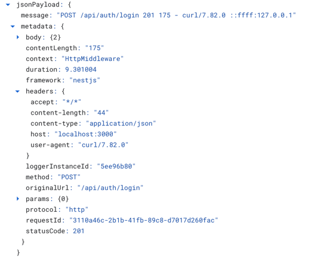

# nestjs-cloud-logging

[](https://www.npmjs.com/package/nestjs-cloud-logging)
[](https://github.com/budiselic/nestjs-cloud-logging/actions/workflows/ci.yml)
[](./LICENSE)

A NestJS logger that keeps the familiar `ConsoleLogger` output while sending
structured entries to [Google Cloud Logging](https://cloud.google.com/logging)
through Winston. HTTP logs include request-scoped metadata backed by
`AsyncLocalStorage`, so logs created by services handling the same request can
be correlated with a request ID and other request details.

## Requirements

- Node.js 22 or newer
- NestJS 10.4.16+ or 11.1.18+
- The NestJS Express platform adapter
- A Google Cloud project with the Cloud Logging API enabled

## Installation

```bash
npm install nestjs-cloud-logging
```

## Google Cloud authentication

[Application Default Credentials (ADC)](https://cloud.google.com/docs/authentication/provide-credentials-adc)
are recommended. On Google Cloud runtimes, the transport can usually discover
the project and credentials automatically:

```typescript
WinstonLoggerModule.forRoot({
    isGlobal: true,
});
```

For local development, set `GOOGLE_APPLICATION_CREDENTIALS` or pass the legacy
`projectId` and `keyFilename` options explicitly. The service account needs the
Logs Writer role (`roles/logging.logWriter`). Do not commit service-account keys
to source control.

## Setup

Import the module in the root application module:

```typescript
// app.module.ts
import { Module } from '@nestjs/common';
import { WinstonLoggerModule } from 'nestjs-cloud-logging';

@Module({
    imports: [
        WinstonLoggerModule.forRoot({
            isGlobal: true,
            level: 'info',
            defaultMeta: {
                service: 'users-api',
                environment: process.env.NODE_ENV,
            },
            transportOptions: {
                logName: 'application',
            },
            http: {
                captureBody: false,
            },
        }),
    ],
})
export class AppModule {}
```

Replace Nest's application logger during bootstrap. `bufferLogs` keeps startup
logs until the custom logger is ready:

```typescript
// main.ts
import { NestFactory } from '@nestjs/core';
import { LoggerService, WinstonLoggerServiceApp } from 'nestjs-cloud-logging';
import { AppModule } from './app.module';

async function bootstrap() {
    const app = await NestFactory.create(AppModule, { bufferLogs: true });
    const logger = app.get<LoggerService>(WinstonLoggerServiceApp);

    app.useLogger(logger);
    await app.listen(3000);
}

void bootstrap();
```

## Injecting the logger

Use `@Logger()` wherever you would inject a Nest provider. Each injected logger
gets the consuming class name as its default context.

```typescript
import { Injectable } from '@nestjs/common';
import { Logger, LoggerService } from 'nestjs-cloud-logging';

@Injectable()
export class UserService {
    constructor(@Logger() private readonly logger: LoggerService) {}

    findOne(id: string) {
        this.logger.log(`Loading user ${id}`);
        this.logger.warn('Custom context example', 'Users');
    }
}
```

The logger supports Nest's `log`, `error`, `warn`, `debug`, `verbose`, and
`fatal` levels. `fatal` is sent through Winston's `error` level and includes
`nestLevel: "fatal"` metadata.

## HTTP request metadata

The middleware creates its metadata before calling the next handler, making it
available to synchronous and asynchronous logs throughout the request. The
completion entry includes:

| Field                               | Description                                                 |
| ----------------------------------- | ----------------------------------------------------------- |
| `requestId`                         | Existing `x-request-id` value or a generated UUID           |
| `protocol`, `method`, `originalUrl` | Request routing details                                     |
| `params`                            | Express route parameters                                    |
| `headers`                           | Request headers with sensitive values redacted              |
| `body`                              | Request body with common secret fields recursively redacted |
| `user`                              | Decoded bearer-token payload, when present                  |
| `statusCode`, `contentLength`       | Response details                                            |
| `duration`                          | Request duration in milliseconds                            |
| `aborted`                           | `true` when the connection closes before finishing          |



### Security and privacy

`authorization`, `cookie`, `proxy-authorization`, `set-cookie`, and `x-api-key`
headers are always redacted. Common body fields such as `password`, `token`,
`secret`, and `apiKey` are also redacted. Add application-specific names with
`redactHeaders` and `redactFields`.

Request-body capture remains enabled by default for backward compatibility.
Disable it for APIs handling personal, financial, health, or other sensitive
data:

```typescript
WinstonLoggerModule.forRoot({
    http: {
        captureBody: false,
        captureHeaders: true,
        captureUser: false,
    },
});
```

Bearer-token payloads are decoded only to enrich logs; they are **not verified**
by this package. Authentication and authorization must remain the responsibility
of your NestJS guards.

## Configuration

| Option             | Type                          | Default                   | Description                                                       |
| ------------------ | ----------------------------- | ------------------------- | ----------------------------------------------------------------- |
| `isGlobal`         | `boolean`                     | `false`                   | Registers the module globally                                     |
| `level`            | `string`                      | `debug`                   | Minimum Winston log level                                         |
| `defaultMeta`      | `Record<string, unknown>`     | `{ framework: "nestjs" }` | Metadata included with every entry                                |
| `projectId`        | `string`                      | auto-detected             | Google Cloud project ID                                           |
| `keyFilename`      | `string`                      | ADC                       | Path to a service-account key                                     |
| `transportOptions` | `LoggingWinstonOptions`       | `{}`                      | Additional Google transport options                               |
| `http`             | `HttpLoggingOptions \| false` | enabled                   | HTTP metadata configuration, or `false` to disable the middleware |

`HttpLoggingOptions` supports:

| Option            | Default        | Description                                    |
| ----------------- | -------------- | ---------------------------------------------- |
| `captureHeaders`  | `true`         | Include sanitized request headers              |
| `captureBody`     | `true`         | Include the recursively sanitized request body |
| `captureUser`     | `true`         | Decode and include the bearer-token payload    |
| `requestIdHeader` | `x-request-id` | Header used for an upstream request ID         |
| `redactHeaders`   | `[]`           | Additional header names to redact              |
| `redactFields`    | `[]`           | Additional body field names to redact          |
| `redactedValue`   | `[REDACTED]`   | Replacement used for secret values             |

## Adding request-scoped metadata

Code running inside an HTTP request can add values to the active log context:

```typescript
import { loggerStorage } from 'nestjs-cloud-logging';

loggerStorage.getStore()?.set('tenantId', tenantId);
loggerStorage.getStore()?.set('operation', 'sync-users');
```

Those values are included in subsequent logs for that request only.

## Development

```bash
npm run format:check
npm run lint
npm test
npm run test:coverage
npm pack --dry-run
```

`npm run verify` runs formatting, linting, the TypeScript build, and all tests.
CI verifies the package against NestJS 10 and 11 on Node.js 22, 24, and 26.
The published package is restricted to compiled files, this README, the image,
the package manifest, and the license.

## License

[MIT](./LICENSE) © Antonio Budiselić
